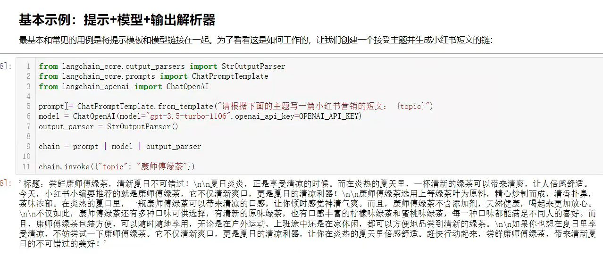
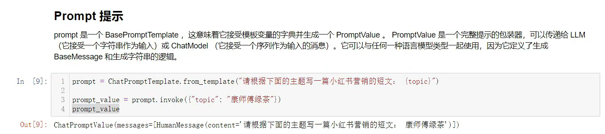
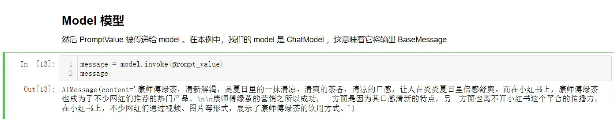
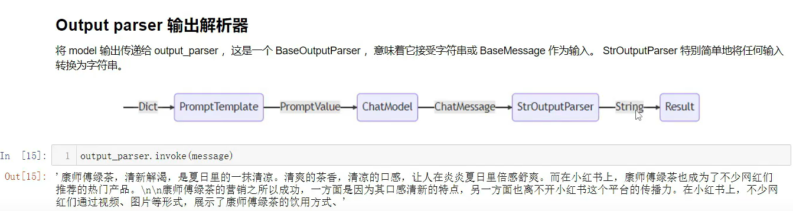
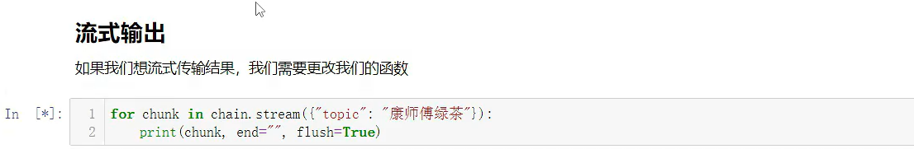
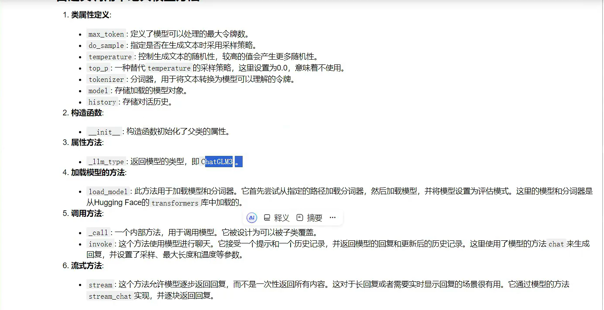
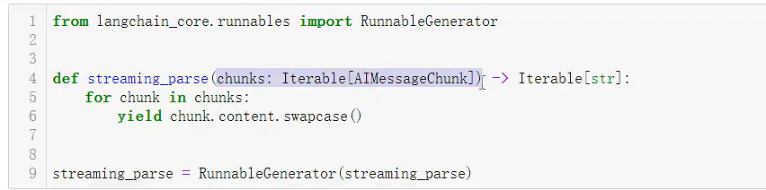

chains ,Agent , advanced Retrieval Strategies  高级检索技术
基本案例：提示+ 模型 + 输出解析器

智普AI GLM 
自己设计类的参数

# 管道提示词
管道提示词可以将多个提示组合在一起，当想使用重复部分可以使用pipelinePrompt 

最终提示：返回的最终提示

管道提示：元组列表，有字符串名称和提示模板组成，每个提示词将被格式化，然后作为具有相同名称的变量传递到未来的提示模板

# Caching
langchain为LLM提供了可选的缓存层，这很有用，原因有两个：
如果经常多次调用相同的，它可以通过减少对LLM提供程序进行的API调用的次数节约资金
通过减少对LLM提供程序进行的API调用次数来加速应用程序
from langchain.prompts import PromptTemplate, PipelinePromptTemplate
步骤1：生成主题的提示模板
topic_prompt = PromptTemplate.from_template(
    input_variables=["domain"],  # 输入变量：领域
    template="请生成一个关于 {domain} 的技术博客主题。"
)
步骤2：生成章节的提示模板（依赖主题）
sections_prompt = PromptTemplate.from_template(
    input_variables=["blog_topic"],  # 输入变量：来自步骤1的输出
    template="基于主题《{blog_topic}》，生成3个核心章节标题。"
)
步骤3：生成内容的提示模板（依赖主题和章节）
content_prompt = PromptTemplate.from_template(
    input_variables=["blog_topic", "blog_sections"],  # 输入变量：来自步骤1和步骤2
    template="根据主题《{blog_topic}》和章节：\n{blog_sections}\n生成详细内容。"
)
定义管道提示的流程（元组列表）
pipeline_prompts = [
    ("topic", topic_prompt),      # 步骤1：生成主题，输出变量名为 blog_topic
    ("sections", sections_prompt), # 步骤2：生成章节，输出变量名为 blog_sections
    ("content", content_prompt)   # 步骤3：生成内容，输出变量为最终结果
]
创建管道提示模板
final_prompt = PipelinePromptTemplate(
    final_prompt=content_prompt,  # 最终使用的提示模板
    pipeline_prompts=pipeline_prompts
)
格式化输入（初始变量）
formatted_prompt = final_prompt.format(
    domain="机器学习"
)
输出最终的完整提示
print(formatted_prompt)
结果：
根据主题《请生成一个关于 机器学习 的技术博客主题。》和章节：
基于主题《请生成一个关于 机器学习 的技术博客主题。》，生成3个核心章节标题。
生成详细内容。

#可运行的lambda和生成器

json.loads()：解析一个有效的JSON字符串并将其转换为Python字典
json.load()：从一个文件读取JSON类型的数据，然后转转换成Python字典
